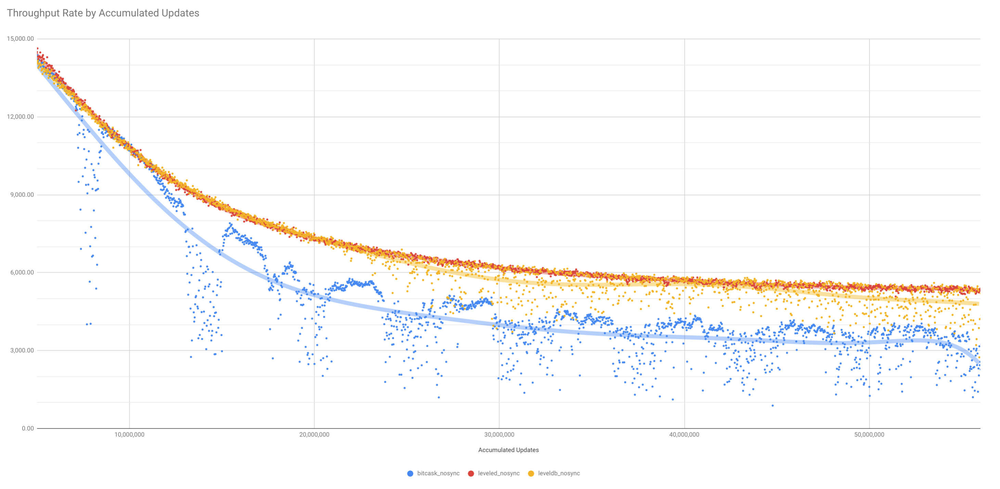
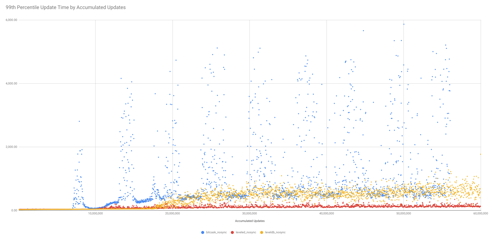
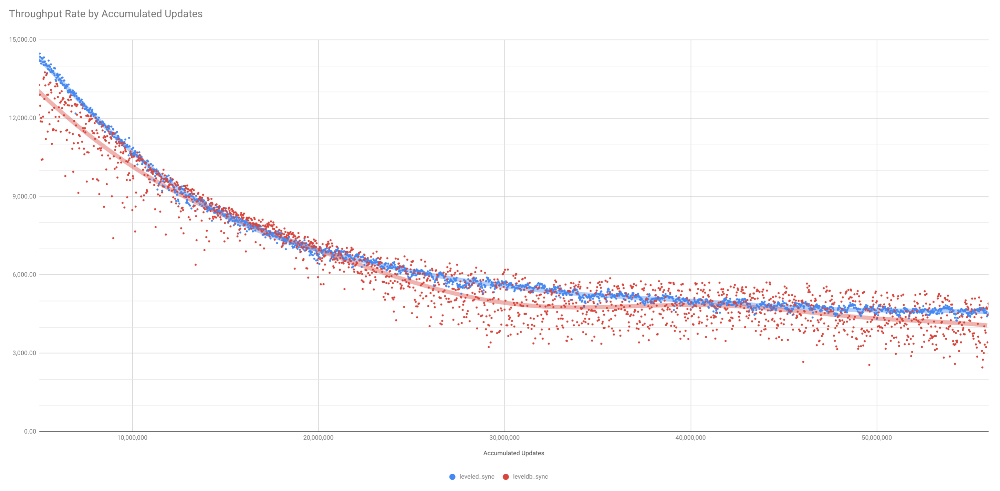
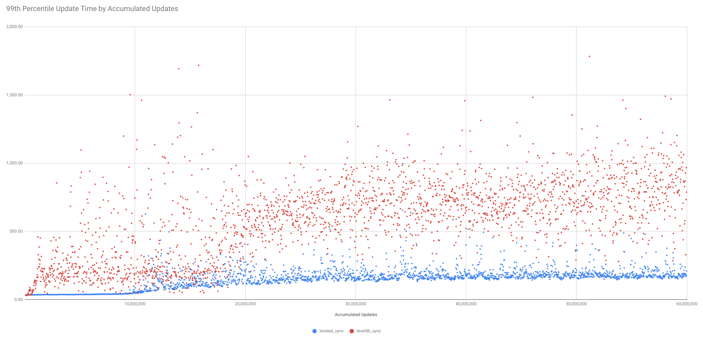
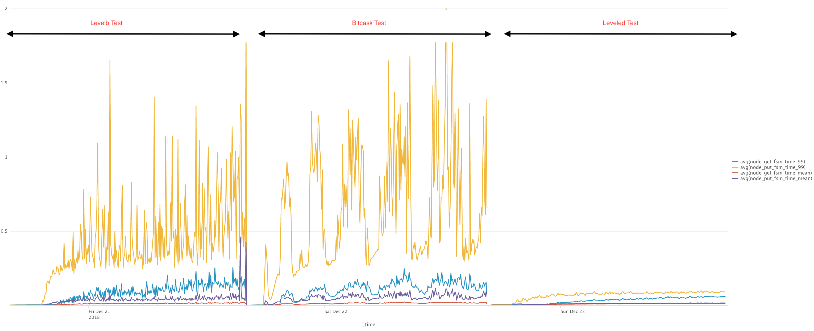
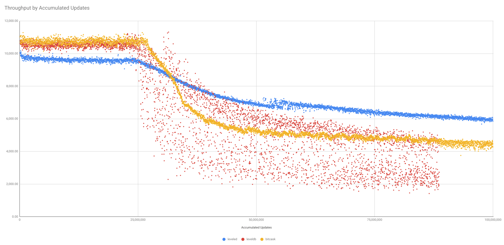

# Choice of Key-Value Backends

Riak has always had the option of storing data in different backends.  Riak is an orchestration of multiple small databases across multiple nodes, co-ordinating requests to create the behaviour of one large highly-available database form these smaller components.  

Prior to Release 2.9, the following database choices existed:

- `bitcask` (the default);
- `eleveldb`;
- `in-memory` (never recommended for production workloads);
- `hanoidb` (not previously supported by Basho, no longer actively worked on).

Following the release of 2.9, support has now been added for the [`leveled` database](https://github.com/martinsumner/leveled), which has been designed from the ground-up to be optimised for certain Riak workloads.

The following guidance is provided to assist when choosing a backend for the future.

## bitcask

*Avoid* deploying `bitcask` if:

- There is a need secondary indexing as a Riak feature (although application-managed secondary indexes can still be created in Riak with bitcask, using Riak objects to hold sets that represent the index).

Apply *caution* when deploying `bitcask` if:

- There is a requirement for writes to be flushed to disk before acknowledgement.  This feature is only supported with the riskier `nif` option for file I/O management, and there exists doubt over whether it works as expected even in this case.

- There is a significant proportion of objects that will be mutated, and no natural "merge window" to schedule merge activity.  Merges may have volatile and unpredictable impacts on cluster performance.

- There is a risk that the cluster cannot be sufficiently scaled horizontally so that all keys fit in memory.

- Objects can be compressed using standard algorithms, but there is no capacity to manage the compression in the application.  as bitcask doesn't compress objects before storage, this may have an impact on both disk utilisation and busyness.

*Prefer* deploying `bitcask` if:

- There is a long-term goal of being able to support the system in-house, and simplicity of underlying products is a requirement for achieving that goal.

- Objects are of a small to medium size (< 10KB) and often immutable.

- Long-term historic testing of the backend in production systems is imperative.

## eleveldb

*Avoid* deploying `eleveldb` if:

- There is a requirement for objects to have a time-to-live.

Apply *caution* when deploying `eleveldb` if:

- Object sizes are large (e.g. o(10KB) or higher), and a significant proportion of load is PUT traffic (e.g. 20% or more).  Write amplification may have a significant impact on database throughput.  This point is especially true if writes are to be sync-flushed to disk

- There is concern over the capability to resolve in-house any problems that arise in the a management of complex software packages written in C++.

- There is a need for rsync-style backup strategies.

*Prefer* deploying `eleveldb` if:

- Objects sizes are small, secondary indexes are needed and median latency is required to be minimised.

- The platform has sufficient memory and/or disk throughput to make the workload CPU bound.

- Long-term historic testing of the backend in production systems is imperative.

- Objects are mutated frequently, and the majority of mutating objects fit within the available memory.

## leveled

*Avoid* deploying `leveled` if:

- Long-term historic testing of the backend in production systems is imperative.

Apply *caution* when deploying `leveled` if:

- Low median latency is critical.

- Object sizes are small (in particular if the proportion of metadata to body is << 1:10).

*Prefer* deploying `leveled` if:

- Object sizes are large, and a significant proportion of objects are mutable.

- Workloads are likely to be disk-bound or network-bound (but not CPU bound).

- A medium-term roadmap of new features is preferred.

- There is a preference for managing support risk by maintaining Riak as single language (Erlang) solution.

- Managing response time volatility is critical, minimising the 99the percentile and maximum response times in comparison to the mean response time.

## Sample Volume Test results

A 24-hour basho_bench test was run without 2i, only GET and UPDATEs, on all three backends with default configuration.  Legacy anti-entropy was used in `bitcask` and `eleveldb` testing, and Native Tictac AAE in `leveled` testing.

### Test 1 - Large Objects and No Sync

The test configuration was as follows:

```
{mode, max}.

{duration, 1440}.
{report_interval, 10}.

{concurrent, 100}.

{driver, basho_bench_driver_riakc_pb}.

{key_generator, {eightytwenty_int, 60000000}}.

{value_generator, {semi_compressible, 8000, 8000, 10, 0.1}}.
```

This tests uses relatively large and compressible objects, with a 20% of the objects being subject to a reasonable degree of update churn.

The test hardware was a 7-node cluster (an odd number of nodes was chosen deliberately to cause some imbalance of vnode distribution).  The test hardware had a set of 8 HDD drives fronted by a 2GB FBWC to offer fast write performance.

The comparison of throughput by volume of updates was as follows:



For response times, there was significant difference in the 99th percentile UPDATE times:



Some facts related to this comparison:

- During the leveled backend test the cluster was close to disk I/O capacity but generally limited by hitting the network capacity of the test harness.

- The dips in throughput in the bitcask test are related to merges.  With default settings, bitcask will have a tendency to merge all files in a backend in the same merge process, and run multiple merges concurrently.

- Bitcask outside of merge windows was up against the disk I/O limit - reflecting the extra disk I/O work associated with storing larger (uncompressed objects).

- Bitcask use of disk space was significantly higher, and much more volatile during compaction (i.e. merge) events compared to other backends.

- Median latency for GET requests was lowest in the leveldb tests.

### Test 2 - Large Objects and Sync

Same test configuration as with Test 1, but with sync on write enabled on the backend.  There were issues confirming sync was working as expected with bitcask, and so no bitcask results were taken.

The comparison of throughput by volume of updates was as follows:



For response times, there was significant difference in the 99th percentile UPDATE times:



Some facts related to this comparison:

- Enabling flushing of writes makes disk I/O not network the bottleneck (once the on-disk size of the system outgrows the cache).

- The point of outgrowing the cache is later with leveldb - it manages its cache more efficiently than leveled.

- There is very little relative change (between the backends) in turning on flushing of writes, however, the hardware uses FBWC that reduces the additional latency normally associated write flushing.

### Test 3 - Mid Objects, Bigger KeySpace and No Sync

The test configuration was as with Test 1, but now with the object size halved but the keyspace doubled:

```
{mode, max}.

{duration, 1440}.
{report_interval, 10}.

{concurrent, 100}.

{driver, basho_bench_driver_riakc_pb}.

{key_generator, {eightytwenty_int, 120000000}}.

{value_generator, {semi_compressible, 4000, 4000, 10, 0.1}}.
```


The comparison of throughput by accumulated volume of updates is:


For response times, there was significant difference in the 99th percentile UPDATE times in particular:



Leveldb managed disk space most efficiently during the test:


The additional throughput achieved with leveled, required significant additional CPU time to achieve:


Some facts related to this comparison:

- Despite the change in test parameters the delta between leveldb and leveldb backends remained relatively constant - leveled achieved 6.32% more throughput in this test, compared to a 6.11% advantage in test 1.

### Test 4 - Immutable Objects, Insert Out of Order and No Sync

The test configuration now makes sure that each object is unique, it is only inserted once and never mutated.  The keys generated are in a randomised order, so puts do not occur in sequence.  Objects can no longer be compressed by the backend (they are randomised bytes), and are a consistent 8KB in size.

GET requests for the object always find a key (there are no GETs for objects which have not been inserted), but are not biased towards a portion of the keyspace - so fewer requested values will be in the backend object cache.

For all backends flushing of writes to disk was left in the control of the operating system - there were no explicit flushes.

```
{mode, max}.

{duration, 1440}.
{report_interval, 10}.

{concurrent, 100}.

{driver, basho_bench_driver_nhs}.

{unique, {8000, skew_order}}.

{operations, [{get_unique, 3}, {put_unique, 1}]}.
```

The comparison of throughput by accumulated volume of updates is:



Some facts related to this comparison:

- The workload is specifically suited to bitcask by comparison to leveldb.  Leveled still outperforms leveldb because of the high number of GET requests that come from outside of the backend cache (due to the non-pareto distribution of requests).

- Write amplification due to the unordered nature of the insert causes significant throughput volatility with the leveldb backend.

- At the start of the test, whilst all data is in memory, throughput for both bitcask and leveldb is significantly greater than for leveled.

### Test 5 - Immutable Objects, Insert In Order and No Sync
