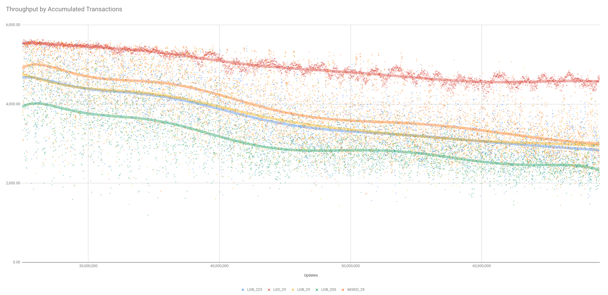
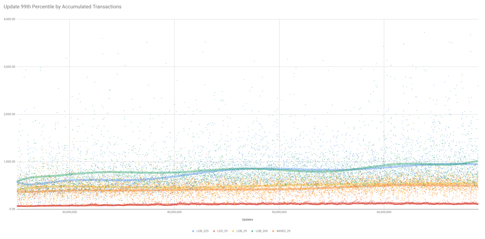
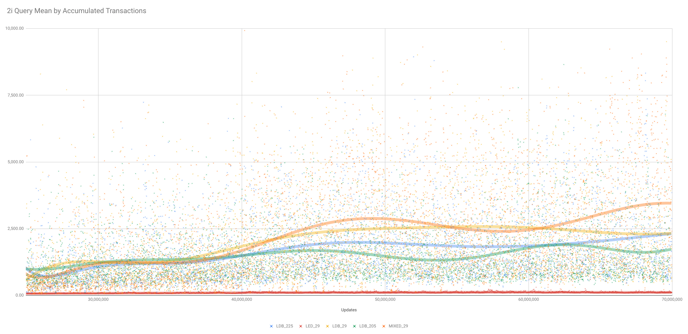

# Test Summary

Summary of test work for the release of Riak 2.9.

More information on the features are available in the [release summary](Release 2.9 Series - Overview.md).

## Volume testing

Prior to the final test cycle, the underlying features of Riak 2.9 have been subject to thousands of hours of performance testing over the past 2 years.  This testing has focused on the Leveled backend, but there has also been multiple tests of the performance of vnode soft-limits and Tictactree AAE.  This testing has been run on both EC2 and physical environments, focused on testing performance with:

- Medium to large value sizes (4KB +)
- Workloads with a small percentage (< 1%) of 2i queries
- Cluster sizes between 5 and 8 nodes
- Soak testing, with max concurrent workers sufficient to cause resource bottlenecks to be reached once data volumes increase to non-trivial Levels
- A variety of disk configurations (SSDs, HDDs, HDDs with FBWC), with and without disk flushing on writes enabled

During the final weeks of the release process, the main focus prior to release has been on testing 7-node clusters with HDDs and FBWC and flush on write enabled.  The bench script used is the [general NHS workload](https://github.com/martinsumner/basho_bench/blob/mas-nhsload-allfound/examples/riakc_nhs_general.config).

Throughput:

99th percentile update latency

Mean 2i query response time

The five scenarios charted here are:

- LDB_205 - Riak 2.0.5 with a LevelDB backend
- LDB_225 - Riak 2.2.5 with a LevelDB backend
- LDB_29 - Riak 2.9 with a LevelDB backend
- LED_29 - Riak 2.9 with a LevelED backend
- MIXED_29 - Riak 2.9 with some 4 nodes LevelDB backend, 3 nodes LevelED

The summary of the what has been discovered in these volume tests are:

- with larger objects (e.g. > 4KB) and a reasonable proportion of update requests (>10%) throughput in LevelDB clusters is impacted by the disk I/O associated with LSM-tree compaction (and consequent write amplification);
- throughput can be increased in these scenarios by using the leveled backend, in this test case by more than 50%;
- high percentile put times are improved with the Leveldb backend through the vnode_soft_limits feature, the cause of high PUT times being variability in vnode queue sizes;
- vnode queue sizes for all work types are improved by the HEAD then GET process with a HEAD capable backend in 2.9;
- without controls in vnode_queue_sizes, 2i query responses times suffer a significant impact under load pressure, and this isn't improved in 2.9 with leveldb (unless the backend change is made).

Other key take-aways from performance testing include:

- On equivalent test loads, leveled backends require about 5% more CPU when compared to equivalent load on the leveldb backend.
- With consistent transfer-limit settings, a leveldb node can receive a node transfer in a lower time than a leveled node.
- It is much safer to increase the transfer-limit with a transfer to a leveled backend (compared with a transfer to a leveldb backend).  A 4-fold increase in transfer-limit was tested to have a lower impact on high percentile latency.
- Enabling flushing of every write can have a significant impact on database throughput, although the use of SSDs and FBWC can offer significant mitigation.  Setting the database to flush on every write on just the PUT co-ordinator had a measurable difference, but insufficient to justify the additional complexity of supporting this as an option.
- The use of a GET co-ordinator (and therefore a move from n HEADs to n-1 HEAD requests), was shown to increase throughput by around 4%.  However, there was concern that relative volatility may increase during node failure, and so this option has not been pursued.
- Without load pressure, Riak with leveldb generally has a lower median latency than Riak with the leveled backend.

## Functional Testing

### Test Results - Round 1

The first full test run for 2.9 is based on a partial feature set.

This includes:
- Leveled backend support;
- GET FSM refactor (to support HEAD requests);
- Vnode soft-limits;
- Core node worker pool;
- Cluster-wide AAE folds;
- TictacAAE.

This does not include:
- Hot backup;
- bet365 repl enhancements;
- Cluster-wide AAE API.

The results of the First round of testing are:

Test Suite |  Leveled backend | Bitcask backend | Eleveldb backend
:-------------------------:|:-------------------------:|:-------------------------:|:-------------------------:
KV_all | All pass | All pass | All pass
2i_all | All pass | n/a | All pass
mapred_all | All pass | All pass | [mapred_search_switch](#mapred_search_switch)
pipe_all | All pass | All pass | All pass
core_all | All pass | All pass | All pass
rtc_all | All pass | All pass | All pass
datatypes_all | [verify_counter_converge](#verify_counter_converge) | All pass | All pass
repl_all | [repl_aae_fullsync](#repl_aae_fullsync)| [repl_aae_fullsync](#repl_aae_fullsync) | [repl_aae_fullsync](#repl_aae_fullsync)
admin_all | All pass | All pass | All pass
yoko | n/a |  |
ensemble | n/a |  |
eqc |  |  |
cluster_upgrade | n/a | [repl_bucket_types](#repl_bucket_types) + many others |
bitcask_only | n/a | [verify_bitcask_tombstone2_upgrade](#verify_bitcask_tombstone2_upgrade) | n/a
eleveldb_only | n/a | n/a | All pass

### Test Failures - Round 1

Round 1 of testing showed no serious issues. Test failures that did occur were either non-replicable or known causes of failure.  The `repl_aae_fullsync` failure presumably did not occur in the 2.2.3 release (the last Basho release) - however it now fails on a situation known to occur in production, so the test is simply genuine.

All new features have passing tests.  There is an outstanding action to consider if test coverage of the new get_fsm/get_core code to support HEAD requests is adequate.  

#### mapred_search_switch

this is proving hard to replicate.  After initially seeing it twice, both times with an eleveldb backend, since there has been ten successive runs of the test without a repeat.

#### verify_counter_converge

This test fails consistently with the leveled backend when [testing for the counter result in the partition which had received an increment](https://github.com/nhs-riak/riak_test/blob/develop-2.2.X-leveled-mas/tests/verify_counter_converge.erl#L59).  However, this appears to be sensitive to very small changes in timings:

- Adding a small sleep prior to the increment (and following the partition), leads to a consistent pass;
- Adding a small sleep following the increment leads to a consistent pass;
- Testing on alternative hardware leads to a consistent pass;
- Testing the C1 and C2 clients in separate lines of code (rather than folding over both in one line), with a log written of the results, leads to a consistent pass.

Investigation ongoing.

Update 18:00 3/12/18 -

This test is now passing more than 90% of the time, without a change being made. In the small number of failures, the test is failing as a [404 is returned after the 404s had stopped being returned ](https://github.com/nhs-riak/riak_test/blob/develop-2.2.X-leveled-mas/tests/verify_counter_converge.erl#L96).  This is now on the [test of the second partition](https://github.com/nhs-riak/riak_test/blob/develop-2.2.X-leveled-mas/tests/verify_counter_converge.erl#L60) not [the first](https://github.com/nhs-riak/riak_test/blob/develop-2.2.X-leveled-mas/tests/verify_counter_converge.erl#L59).

Update 18:00 14/12/18 -

I've now seen the intermittent failure again, this time on eleveldb backend.  The failure is still rare and hard to reproduce.

#### repl_aae_fullsync

This fails when validating an intercepted full-sync, in particular:

`Validating intercept {riak_kv_index_hashtree, [{{get_lock,4},not_built}]} on 'dev1@127.0.0.1'`

However - this does align with a known issue.  AAE full-sync fails whenever the hashtrees are not built.

#### repl_bucket_types

This fails at the very start of the test when waiting for the clusters to build, due to the riak_repl service not starting (the startup monitors for riak_repl, and never sees it).

This looks like an issue with the switch from riak  to riak_ee.  The problem appears to be when starting a riak 2.0.5 node and waiting for riak_repl to appear.  Does riak 2.0.5 need to be riak ee not riak?

Note repl_bucket_types has now been re-assigned into the cluster_upgrade group.

#### verify_bitcask_tombstone2_upgrade

This test is due to a `enoent` failure when switching the configuration file.

### Test Results - Round 2

This round of testing was performed on the public Release Candidate.  The results of the second round of testing are:

Test Suite |  Leveled (0.9.9) | Leveled (0.9.10) | Bitcask | Eleveldb
:-------------------------:|:-------------------------:|:-------------------------:|:-------------------------:|:-------------------------:
KV_all | [verify_conditional_postcommit](#verify_conditional_postcommit) | [verify_conditional_postcommit](#verify_conditional_postcommit) | kv679_dataloss_fb verify_api_timeouts | [verify_conditional_postcommit](#verify_conditional_postcommit)
2i_all |  All pass | All pass | n/a | All pass
mapred_all | All pass | All pass | mapred_search_switch | mapred_search_switch
pipe_all | All pass | All pass | All pass | All pass
core_all | All pass | All pass | All pass | cluster_meta_rmr
rtc_all | All pass | All pass | All pass | All pass
datatypes_all | All pass | All pass | [verfiy_counter_converge](#verify_counter_converge) | All pass
repl_all | repl_aae_fullsync_custom_n | repl_aae_fullsync_custom_n | repl_aae_fullsync_custom_n | repl_rt_overload
admin_all | All pass | All pass | All pass | All pass
yoko | n/a |  |  |
ensemble | ensemble_byzantine |  | ensemble_remove_node | ensemble_remove_node ensemble_remove_node2
cluster_upgrade | n/a | n/a | n/a | [verify_kv1356](#verify_kv1356) [verify_membackend](#verify_membackend) [verify_riak_object_reformat](#verify_riak_object_reformat)
bitcask_only | n/a | n/a | All pass | n/a
eleveldb_only | n/a | n/a | n/a | All pass

Repeating for failed tests (3 runs per backend):

Test |  Leveled backend | Bitcask backend | Eleveldb backend
:-------------------------:|:-------------------------:|:-------------------------:|:-------------------------:
kv679_dataloss_fb | All pass | All pass | All pass
verify_conditional_postcommit | All pass | 1 fail | 2 fail
verify_api_timeouts | All pass | All pass | All pass
mapred_search_switch | 1 fail | All pass | 3 fail
cluster_meta_rmr | 1 fail | All pass | 3 fail
verify_counter_converge | All pass | 1 fail | 1 fail
ensemble_byzantine | 1 fail | All pass | All pass
ensemble_remove_node | All pass | 1 fail | 2 fail
ensemble_remove_node2 | 1 fail | All pass | All pass
repl_aae_fullsync_custom_n | All pass | 1 fail | 1 fail
repl_rt_overload | 3 fail | 1 fail | 2 fail

#### verify_conditional_postcommit

Gets 999 results when expecting 1000.  This is due to an inherent race condition in the test code itself:

https://github.com/nhs-riak/riak_test/blob/develop-2.2.X-leveled-mas/tests/verify_conditional_postcommit.erl#L77-L80

The get_env may fire for one PUT before the set_env has completed for another PUT - and then the count will fall 1 behind.  On failure, have confirmed through logging that all post commits have fired.  This is a test that needs fixing, but not a Riak KV code issue.

#### repl_rt_overload

No longer able to replicate when running as a single test.

#### cluster_meta_rmr

This appears to be as a result of running the test with ulimit set too low.  Having increased ulimit this test now consistently passes.

#### mapred_search_switch

As this is Yokozuna related, there is no immediate intention to troubleshoot this intermittent failure.

#### verify_riak_object_reformat

Test was failing as it was being run using the `spine_ee` profile not the `spine`, and hit the issue of copying `jmx` configuration into the current version which is no longer supported.  Switched to the `spine` profile and test now passes.

#### verify_kv1356

Test was failing as it sets a particular path which it assumes exists (And doesn't on the test machine).  Using default settings (and a proper wait) the test passes.  Will remove test from group going forward, as it appears to add no value - just a throwaway starter before writing a fix.

#### verify_membackend

This fails when measuring the change in memory caused by re-putting the same new object over an existing object - https://github.com/basho/riak_test/blob/develop/tests/verify_membackend.erl#L174-L178.  The difference between the memory used and baseline is 26 bytes and not less than 3.

It is unclear what the value of this test is, or the reasoning why the delta should be less than 3 bytes.  Further, the use of the memory backend is not recommended for production environments.  This test failure should be ignored.
